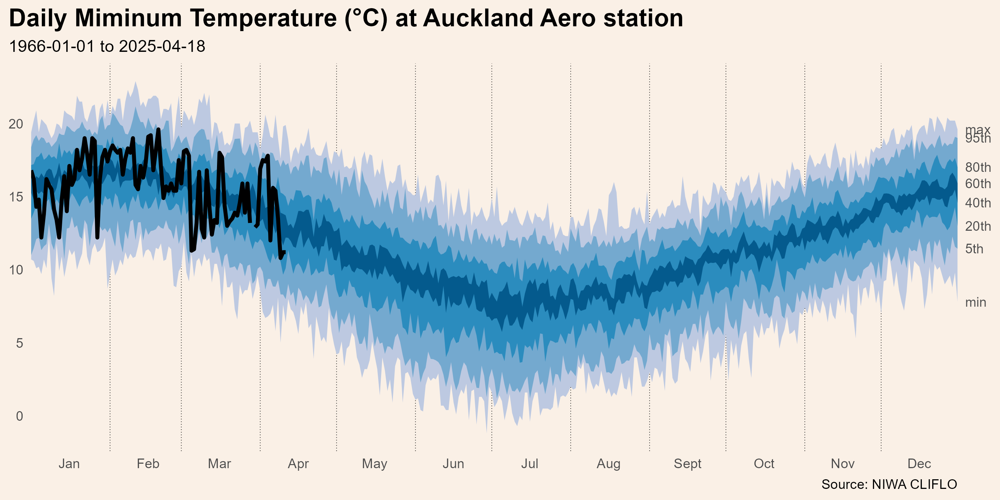

# Auckland weather

How is the weather at the Auckland Aero station compared to historical
values?

Data sourced from [NIWA’s National Climate
Database](https://cliflo.niwa.co.nz/). It doesn’t seem to have an API.
so I can’t schedule updates with github actions.

Data issues:

- It also seems to have a delay of about a month.
- Missing data in 1993/1994

Based on the [jdjohn215 milwaukee-weather github
repo](https://github.com/jdjohn215/milwaukee-weather)
